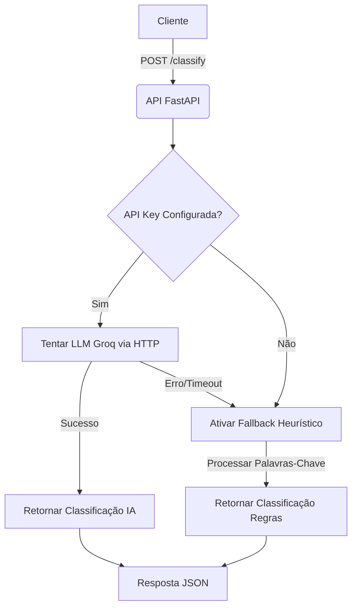

# ⚖️ Nexus Legal Classifier

 API REST para classificação automática de mensagens jurídicas, utilizando uma arquitetura híbrida de Inteligência Artificial Generativa (LLM) com fallback para heurísticas baseadas em regras.

## 🧠 Decisões de Design (Architecture Decision Records)

Para atender ao prazo de 3h e aos requisitos de P&D, adotei as seguintes estratégias:

1. **Arquitetura Híbrida (Strategy Pattern):**
* **Primária (LLM):** Utiliza o modelo **Llama 3-70b** via **Groq** para classificação contextual de alta precisão. O Groq foi escolhido pela inferência de latência ultrabaixa (<1s).
* **Fallback (Resiliência):** Implementei um sistema determinístico baseado em palavras-chave (`Keyword Matching`). Se a API da IA falhar, a internet cair ou a chave não for configurada, o sistema **não para**; ele degrada graciosamente para a heurística.


2. **Tipagem Estrita e Validação:**
* Uso extensivo de `Pydantic` e `Enums` para garantir que dados inválidos sejam barrados antes de chegar à lógica de negócio (Fail Fast).


## 🛠️ Pré-requisitos

* **Python 3.9+** (ou Docker)
* **Git**
* **API Key da Groq** (Opcional, mas recomendada para o modo IA). Obtenha [aqui](https://console.groq.com/).

## 🚀 Instalação e Execução

### Opção 1: Rodando Localmente (Recomendado para Dev)

1. **Clone o repositório:**
```bash
git clone https://github.com/seu-usuario/nexus-legal-classifier.git
cd nexus-legal-classifier

```


2. **Crie e ative o ambiente virtual:**
```bash
python -m venv venv
# Windows:
.\venv\Scripts\activate
# Linux/Mac:
source venv/bin/activate

```


3. **Instale as dependências:**
```bash
pip install -r requirements.txt

```


4. **Configure as Variáveis de Ambiente:**
```bash
cp .env.example .env
# Edite o arquivo .env e adicione sua GROQ_API_KEY

```


5. **Execute a API:**
```bash
uvicorn app.main:app --reload

```


Acesse a documentação em: `http://localhost:8000/docs`

---

## ⚡ Exemplo de Uso (cURL)

Você pode testar a classificação via terminal:

```bash
curl -X 'POST' \
  'http://localhost:8000/classify' \
  -H 'accept: application/json' \
  -H 'Content-Type: application/json' \
  -d '{
  "text": "Doutor, gostaria de saber se o valor dos honorários já inclui as custas do processo."
}'

```

**Resposta Esperada:**

```json
{
  "category": "Financeiro",
  "reasoning": "O usuário questiona sobre honorários e custas processuais, temas estritamente financeiros.",
  "model": "llama-3.3-70b-versatile",
  "strategy": "LLM (Groq)"
}

```


## 🔄 Fluxograma de Execução

O diagrama abaixo ilustra o padrão de resiliência adotado na solução:



## 🔮 Próximos Passos (Roadmap P&D)

Visando a evolução deste protótipo para um produto robusto integrado ao **Nexus**:

1. **RAG (Retrieval-Augmented Generation):** Integrar com **Elasticsearch** para buscar contextos de processos reais antes de classificar, permitindo desambiguação baseada no histórico do cliente.
2. **Vector Database:** Implementar busca semântica (embeddings) para substituir a heurística de palavras-chave, melhorando o fallback.
3. **Observabilidade:** Adicionar exportação de métricas (Prometheus/Grafana) para monitorar custos de tokens e taxa de acerto do modelo.
4. **Segurança:** Adicionar autenticação JWT (OAuth2) para proteger os endpoints.

## 📚 Referências

* [FastAPI Documentation](https://fastapi.tiangolo.com/)
* [Groq Cloud API](https://console.groq.com/docs/quickstart)
* [Pydantic Docs](https://www.google.com/search?q=https://docs.pydantic.dev/)

---

**Desenvolvido por Vitor Hugo Rodovalho**
